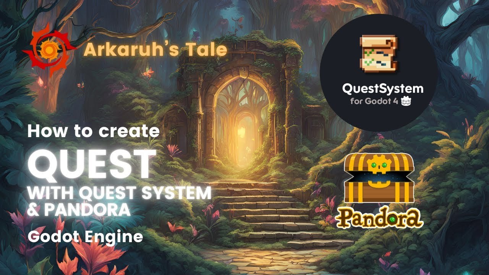

<h1  align="center">
<image src="./icon.svg" alt="QuestSystem" width=128> 
📜 QuestSystem 📜
</h1>

# QuestSystem for Godot 4

QuestSystem is a simple addon for [Godot 4](https://godotengine.org/) that simplifies the creation of custom quests.

## Features

* ✨ Easy to use API
* 🛠️ Support for custom quests
* 🌐 Support for CSV and POT localisation
* 🗃️ Easy serialization & deserialization
* 🧪 Tested API with [GDUnit4](https://github.com/MikeSchulze/gdUnit4)

## Installing

1. Download a [copy](https://codeload.github.com/shomykohai/quest-system/zip/refs/heads/main) of the addon
2. Copy the `addons` folder from the downloaded file to your project directory

## Documentation

You can find more detailed documentation on the [wiki](https://shomykohai.github.io/quest-system/) page.

Main pages:

* [How to install the addon](https://shomykohai.github.io/quest-system/#/installing)
* [Localisation](https://shomykohai.github.io/quest-system/#/translations)
* [API](https://shomykohai.github.io/quest-system/#/api/)

## Examples

Additionally you can find a basic example project on the [quest-system-example](https://github.com/shomykohai/quest-system-example) repo, 
and a more advanced project on the [advanced-quest-system-example](https://github.com/shomykohai/advanced-quest-system-example) (Note: This one integrates other addons with QuestSystem).

## Video guides

* [How to create a quest with Quest System and Pandora | Arkaruh's Tale](https://youtu.be/bc_lB8LNup0)

## License

This project is under the MIT license, see [LICENSE](LICENSE)

