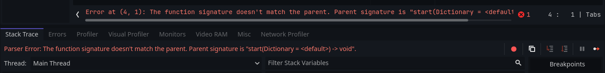

# Migrate from v.1.2.3 to 1.3 and up

In version [1.3]() some minor breaking changes happened: quest methods now accepts optional arguments.<br>
This change has led to old quest scripts to break.<br>
Here's how to fix all the errors you may encounter 
## QUEST RESOURCE

If you encounter a Parse error when updating:

```diff
- Parser Error: The function signature doesn't match the parent. Parent signature is "start(Dictionary = <default>) -> void".
```


Change all your quest scripts, making the following changes:

```gdscript
# script that inherits from Quest

BEFORE
func start() -> void:
    ...

func update() -> void:
    ...

func complete() -> void:
    ...


AFTER
func start(_args: Dictionary = {}) -> void:
	...

func update(_args: Dictionary = {}) -> void:
	...

func complete(_args: Dictionary = {}) -> void:
	...
```
